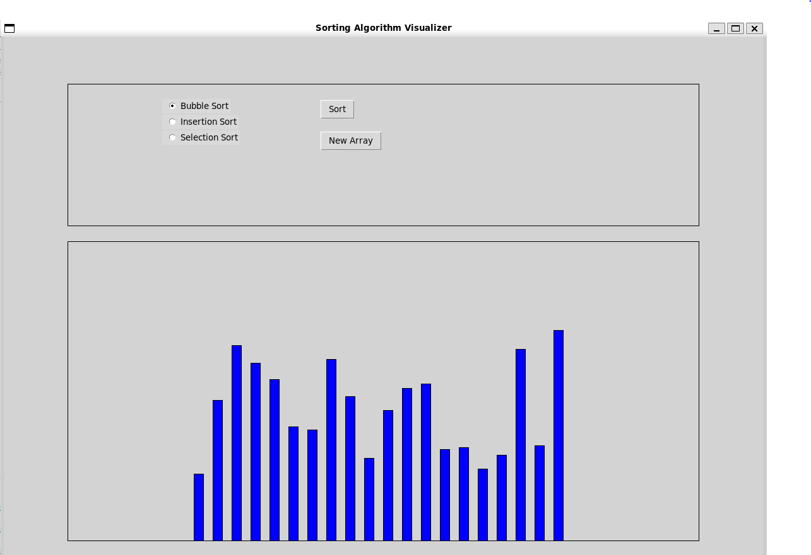

# Sorting-Algorithms-Visualizer

## Overview
The Sorting Algorithms Visualizer is a Python-based application that visualizes various sorting algorithms. It gives a graphical representation of the sorting process, and allows the user to understand visually how the sorting algorithms work.

## Features
 - Bubble Sort
 - Merge Sort
 - Insertion Sort

## Installation
git clone https://github.com/Drewpayton/Sorting-Algorithms-Visualizer.git

cd Sorting-Algorithms-Visualizer

## Usage
python __main__.py
